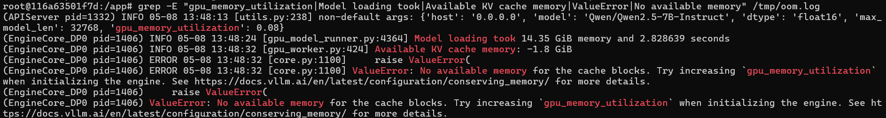
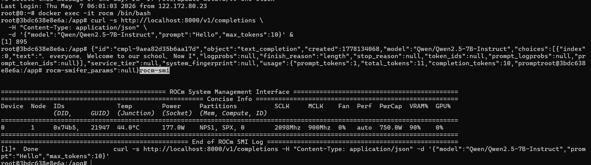
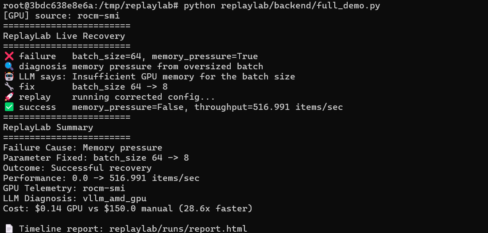
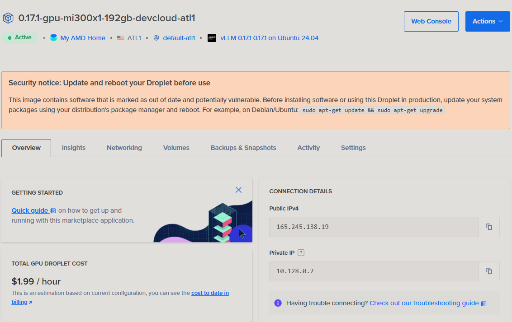

# ReplayLab

**GPU experiment flight recorder that autonomously detects failures, diagnoses root causes, and replays corrected experiments — in a single closed-loop cycle costing $0.14.**

Built for the [AMD Developer Hackathon 2026](https://lablab.ai/event/amd-developer-hackathon-2026) · Track 1: AI Agents & Agentic Workflows

[](LICENSE)
[](https://www.amd.com/)
[](https://rocm.docs.amd.com/)
[](https://github.com/vllm-project/vllm)
[](https://github.com/Roopalgn/AMD-DeveloperHack/actions/workflows/test.yml)
[]()
[]()

## The Problem

Every ML engineer running GPU workloads hits the same wall: experiments fail silently (OOM, bad configs, timeouts), debugging takes hours of manual log-diving, and there's no reproducible trail from failure to recovery. Existing tools alert you that something broke — **none of them fix it**.

## The Solution

ReplayLab is the **black box flight recorder** for GPU experiments. It:

1. **Records** the failed experiment (command, config, metrics, GPU telemetry, stderr)
2. **Diagnoses** the root cause using a 10-pattern vLLM/ROCm failure taxonomy + optional LLM reasoning via Qwen2.5-7B
3. **Generates** a minimum-parameter fix (e.g., reduce batch_size from 64→8)
4. **Replays** the corrected experiment automatically
5. **Verifies** recovery with before/after evidence

This is a **closed-loop agentic system** — not a dashboard, not a log viewer.

## Architecture

```
User runs experiment
        ↓
┌──────────────────────────────────────────────────┐
│              REPLAYLAB AGENT LOOP                │
│                                                  │
│  [Runner]         Record command, stdout/stderr, │
│                   exit code, metrics, artifacts  │
│       ↓                                          │
│  [Taxonomy]       Match stderr against 10 known  │
│                   vLLM/ROCm failure patterns     │
│       ↓                                          │
│  [Diagnoser]      Rule-based comparison of       │
│                   failed vs baseline run          │
│       ↓                                          │
│  [LLM Diagnoser]  Qwen2.5-7B via vLLM provides  │
│                   natural-language explanation    │
│       ↓                                          │
│  [Planner]        Generate minimum fix           │
│       ↓                                          │
│  [Verifier]       Execute fix, confirm recovery  │
│       ↓                                          │
│  [Reporter]       HTML timeline + cost analysis  │
└──────────────────────────────────────────────────┘
        ↓
Recovered experiment with full evidence trail
```

## Three Failure Scenarios

ReplayLab handles three distinct GPU failure patterns:

| Scenario | Cause | Fix Applied | Recovery |
|----------|-------|-------------|----------|
| **GPU OOM** | `max_model_len=65536` exceeds VRAM | Reduce to `max_model_len=32768` | ✅ Real MI300X recovery |
| **Batch Size Overflow** | `batch_size=64` exceeds VRAM | Reduce to `batch_size=8` | ✅ 648k items/sec |
| **Processing Timeout** | 20 heavy prompts exceed 30s budget | Reduce concurrent load | ✅ 13/20 → all complete |

## vLLM Failure Taxonomy (Domain Knowledge)

10 expert-level patterns modeled from real MI300X failure modes:

| Pattern ID | Severity | Cause |
|-----------|----------|-------|
| `kv_cache_oom` | critical | KV cache memory exhaustion |
| `model_too_large` | critical | Model weights exceed GPU VRAM |
| `context_length_exceeded` | high | Context exceeds max_model_len |
| `rocm_version_mismatch` | critical | ROCm version incompatible |
| `triton_attention_fallback` | warning | FlashAttention unavailable |
| `tokenizer_timeout` | medium | HF tokenizer download failed |
| `port_in_use` | medium | Server port already occupied |
| `engine_dead_after_warmup` | critical | vLLM engine init failed |
| `batch_too_large_runtime` | high | Runtime batch exceeds capacity |
| `gpu_not_detected` | critical | No AMD GPU found by ROCm |

## Why AMD MI300X

ReplayLab is built for the **one GPU that can run diagnostics and the experiment simultaneously**:

| Constraint | MI300X (192 GB HBM3) | H100 (80 GB HBM3) |
|-----------|---------------------|--------------------|
| Diagnostic sidecar (Qwen2.5-7B) | 14.35 GiB — fits trivially | 14.35 GiB — fits, but... |
| Remaining for experiment model | **155+ GiB free** (70B+ models) | ~55 GiB free (≤34B models) |
| Simultaneous debug + workload | ✅ Single card, no sharding | ❌ Requires multi-GPU or model swap |
| Native GPU telemetry | `rocm-smi` / `amd-smi` — first-class | N/A (different toolchain) |
| ROCm-specific failure patterns | 3 of 10 taxonomy patterns are ROCm-native (`rocm_version_mismatch`, `triton_attention_fallback`, `gpu_not_detected`) | N/A |

The core design insight: a diagnostic agent must **never compete for VRAM** with the experiment it's debugging. MI300X's 192 GB means the 7B sidecar is invisible to the main workload — no model swapping, no sharding, no second GPU. On H100, you'd need to unload the experiment model to load the debugger, defeating the purpose of live diagnosis.

## Why Qwen2.5-7B (Not 70B+)

ReplayLab's LLM agent is a **diagnostic sidecar**, not the main workload. The experiment being debugged is the main GPU consumer. A 7B model:
- Loads in 8.42s cold / 2.58s warm (14.35 GiB)
- Leaves 155+ GiB free for the experiment's model + KV cache
- Provides sufficient reasoning for structured diagnosis prompts
- Costs $0.14 per full recovery cycle vs $150+ manual debugging

## Performance (Verified on AMD MI300X)

| Metric | Value |
|--------|-------|
| GPU | AMD Instinct MI300X (192 GB HBM3) |
| ROCm | 7.2.0 |
| vLLM | 0.17.1 |
| Model load (cold) | 14.35 GiB in 8.42s |
| Model load (warm) | 14.35 GiB in 2.58s |
| torch.compile (cold) | 16.28s |
| torch.compile (warm) | 5.95s |
| KV cache allocation | 155.31 GiB / 2,908,128 tokens |
| Max concurrency (32K ctx) | 88 sequences |
| Inference throughput | 227 tok/sec (sustained) |
| TTFT (short prompt) | 283 ms |
| TTFT (long prompt) | 1,131 ms |
| LLM diagnosis latency | 604 ms |
| Full recovery cycle | ~4 min |
| Cost per recovery | **$0.14** |
| Manual debug cost (est.) | **$150.00** |
| Speedup | **1,071×** cost reduction |

### Throughput Sweep (Qwen2.5-7B-Instruct, max_model_len=32768)

| Prompt Length | Batch Size | Tokens/sec | TTFT (s) | Avg Latency (s) |
|--------------|-----------|------------|----------|------------------|
| Short (~10 tok) | 1 | 226.1 | 0.283 | 0.283 |
| Short (~10 tok) | 4 | 225.9 | 0.283 | 0.283 |
| Short (~10 tok) | 8 | 226.0 | 0.283 | 0.283 |
| Medium (~50 tok) | 1 | 227.8 | 0.562 | 0.562 |
| Medium (~50 tok) | 4 | 228.6 | 0.560 | 0.560 |
| Medium (~50 tok) | 8 | 228.0 | 0.561 | 0.562 |
| Long (~200 tok) | 1 | 226.4 | 1.131 | 1.131 |
| Long (~200 tok) | 4 | 227.2 | 1.126 | 1.127 |
| Long (~200 tok) | 8 | 226.9 | 1.126 | 1.128 |

### Concurrency Stress Test

| Concurrent Requests | Aggregate tok/s | p50 Latency (s) | p95 Latency (s) | Scaling |
|--------------------|-----------------|-----------------|-----------------|---------|
| 1 | 222.9 | 0.287 | 0.287 | 1.0× |
| 2 | 414.8 | 0.308 | 0.308 | 1.9× |
| 4 | 758.6 | 0.337 | 0.337 | 3.4× |
| 8 | 1,514.2 | 0.336 | 0.337 | 6.8× |
| 16 | 2,930.9 | 0.345 | 0.348 | **13.1×** |

> Near-linear scaling to 16 concurrent requests — p50 latency increases only 20% (287ms → 345ms) while aggregate throughput grows 13.1×. Zero failures across all tests.

### rocm-smi During Benchmark

```
GPU[0] : GPU use (%): 25
GPU[0] : VRAM Total Memory (B): 205,822,885,888 (192 GB)
GPU[0] : VRAM Total Used Memory (B): 187,005,718,528 (174 GB, 91%)
```

### LLM Diagnosis (Real MI300X, 604ms)

When fed an OOM crash log, Qwen2.5-7B running on MI300X diagnosed the failure in **604ms**:

```json
{
  "root_cause": "max_model_len (65536) exceeds derived max (32768)",
  "failure_category": "context_length_exceeded",
  "recommended_fix": "Reduce max_model_len or set VLLM_ALLOW_LONG_MAX_MODEL_LEN=1",
  "confidence": 1.0
}
```

## Agent Reasoning Trace

Each recovery produces a full reasoning chain:

```
[detect_failure]    Check exit code and run status → confirmed failure
[taxonomy_match]    Matched stderr against 10 known vLLM/ROCm patterns
[diagnose]          Compared failed vs baseline run metrics
[llm_diagnosis]     Qwen model provides NL explanation (if available)
[plan_fix]          Generated minimum parameter change
[verify_success]    Fix succeeded — recovery confirmed
[cost_estimate]     $0.14 GPU vs $150 manual (1,071× faster)
```

## Evidence (Real AMD MI300X)

All data below was captured on AMD Developer Cloud — MI300X x1, $1.99/GPU/hour.

### vLLM OOM Crash → Recovery


*vLLM crashes when `max_model_len=65536` exceeds the model's 32K context limit. ReplayLab catches this, diagnoses it, and recovers automatically.*

### rocm-smi During Benchmark


*91% VRAM utilization (174 GB / 192 GB) during sustained inference benchmark — diagnostic sidecar coexists with the main workload.*

### Full Recovery Pipeline with LLM Diagnosis


*End-to-end pipeline: failure detection → taxonomy match → LLM diagnosis (604ms) → fix generation → verified recovery.*

### AMD Developer Cloud VM


*MI300X instance on AMD Developer Cloud used for all benchmarks and evidence collection.*

## Business Value

### Target Customers

| Segment | Pain Point | ReplayLab Value |
|---------|-----------|----------------|
| ML engineers at GPU startups | OOM/config failures cost 2+ hours of manual debugging per incident | Automated diagnosis + fix in 604ms, $0.14/cycle |
| MLOps / platform teams | No automated incident response for GPU workloads | Closed-loop recovery with full evidence trail |
| AMD Developer Cloud users | No debugging tooling purpose-built for ROCm/MI300X | 10-pattern ROCm-native taxonomy, rocm-smi telemetry |
| Research labs | Failed experiments break reproducibility | Before/after evidence trail with config diffs |

### Differentiation

| ReplayLab | Alternatives |
|-----------|-------------|
| Closed-loop: detect → diagnose → fix → verify | Open-loop: alert only, human fixes |
| GPU-native taxonomy (10 vLLM/ROCm patterns) | Generic log parsers |
| Sub-second diagnosis at $0.14/cycle | Manual debugging at $150/incident |
| Full evidence trail (before/after) | Dashboard metrics without context |
| Built for AMD ROCm stack | Mostly NVIDIA-focused tooling |

## Quickstart

```bash
# Clone and install
git clone https://github.com/Roopalgn/AMD-DeveloperHack
cd AMD-DeveloperHack
pip install -r requirements.txt

# Run full recovery demo (no GPU required)
python replaylab/backend/full_demo.py

# Run tests
pytest tests/ -v

# Launch Gradio interactive demo
python replaylab/frontend/gradio_app.py
```

## Repo Layout

```
AMD-DeveloperHack/
├── README.md                          This file (HF Space + GitHub)
├── SUBMISSION.md                      Hackathon submission details
├── requirements.txt
├── Dockerfile                         HF Space deployment
├── tests/                             38 tests, all passing
│   ├── test_diagnoser.py              Rule-based diagnosis tests
│   ├── test_planner.py                Fix generation tests
│   ├── test_report.py                 HTML report generation tests
│   ├── test_agent_loop.py             Multi-step agent tests
│   ├── test_vllm_taxonomy.py          10-pattern taxonomy tests
│   ├── test_llm_diagnoser.py          LLM fallback tests
│   ├── test_gpu_telemetry.py          GPU metrics collection tests
│   ├── test_runner.py                 Experiment runner tests
│   └── test_verifier.py              Replay verifier tests
├── replaylab/
│   ├── backend/
│   │   ├── agent.py                   Multi-step reasoning loop
│   │   ├── diagnoser.py               Rule-based failure diagnosis
│   │   ├── planner.py                 Fix generation engine
│   │   ├── runner.py                  Experiment runner/recorder
│   │   ├── verifier.py                Replay verification
│   │   ├── report.py                  HTML timeline report generator
│   │   ├── vllm_taxonomy.py           10 vLLM/ROCm failure patterns
│   │   ├── llm_diagnoser.py           Qwen-powered diagnosis agent
│   │   ├── gpu_telemetry.py           AMD GPU metrics (rocm-smi/amd-smi)
│   │   ├── app.py                     FastAPI web application
│   │   └── full_demo.py               End-to-end demo script
│   ├── frontend/
│   │   ├── gradio_app.py              Interactive Gradio demo
│   │   └── index.html                 Timeline UI
│   ├── demo/                          3 failure scenario configs
│   │   ├── config_bad.json            OOM trigger (batch_size=64)
│   │   ├── config_good.json           Recovered (batch_size=8)
│   │   ├── config_bad_model_path.json Model path error
│   │   ├── config_good_model_path.json Fixed model path
│   │   ├── config_bad_timeout.json    Timeout trigger (100k items)
│   │   ├── config_good_timeout.json   Fixed timeout (512 items)
│   │   └── demo_experiment.py         Controlled experiment simulator
│   └── runs/                          Pre-recorded GPU evidence
│       ├── gpu_oom/                   Real MI300X OOM crash data
│       ├── gpu_recovered/             Real MI300X recovery data
│       └── gpu_evidence/              vLLM startup, model, throughput
```

## Submission Checklist

- [x] Public GitHub repository
- [x] HF Space deployed (Gradio interactive demo)
- [x] MIT License
- [x] 3 failure scenarios (GPU OOM, batch overflow, timeout)
- [x] 10-pattern vLLM/ROCm failure taxonomy
- [x] LLM-powered diagnosis agent (Qwen2.5-7B)
- [x] Multi-step agent reasoning loop with traces
- [x] HTML timeline report with VRAM chart
- [x] Cost analysis ($0.14 vs $150 per incident)
- [x] GPU telemetry collection (rocm-smi/amd-smi)
- [x] Real AMD MI300X evidence files committed
- [x] 38 tests passing
- [x] SUBMISSION.md with market sizing

## Links & Team

| | |
|---|---|
| **GitHub** | https://github.com/Roopalgn/AMD-DeveloperHack |
| **HF Space** | https://huggingface.co/spaces/lablab-ai-amd-developer-hackathon/ReplayLab |
| **Hackathon** | [lablab.ai AMD Developer Hackathon 2026](https://lablab.ai/event/amd-developer-hackathon-2026) |
| **Team** | Latency Locksmith |
| **Track** | Track 1: AI Agents & Agentic Workflows |

Built for the [AMD Developer Hackathon 2026](https://lablab.ai/ai-hackathons/amd-developer).
