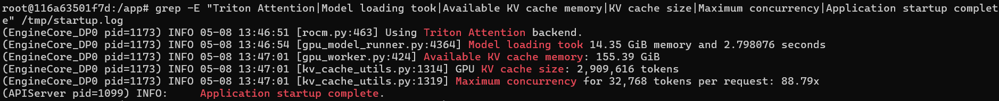
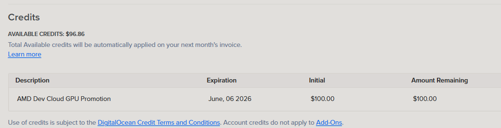

# ReplayLab — The Black Box for GPU Experiments

**AMD Developer Hackathon 2026 | Track 1: AI Agents & Agentic Workflows**

ReplayLab is an autonomous GPU experiment flight recorder. It watches a real AMD GPU workload fail, diagnoses the root cause using AI, generates a corrected replay command, and verifies the recovery — all without human intervention.

> Failed runs aren't bugs to hide. They're evidence to learn from.

---

## The Problem

GPU experiments fail in expensive, messy ways: bad batch sizes cause OOM, configs drift between runs, model paths break, and serving parameters silently degrade performance. Engineers fix these quickly — but later can't prove *what* failed, *what* changed, or *how* to reproduce the working result.

For ML teams shipping under deadline, this makes GPU development fragile and hard to trust.

## How ReplayLab Solves It

```
FAIL → RECORD → DIAGNOSE → FIX → REPLAY → VERIFY
```

1. **FAIL** — A GPU experiment fails or degrades (real AMD GPU workload)
2. **RECORD** — ReplayLab captures command, config, logs, exit code, GPU telemetry, and artifacts
3. **DIAGNOSE** — AI agent identifies the root cause (LLM-powered via Qwen on AMD GPU + rule-based fallback)
4. **FIX** — Generates a corrected replay command with the minimum parameter change
5. **REPLAY** — Executes the fixed command automatically
6. **VERIFY** — Proves recovery with before/after metrics and GPU evidence

## Real GPU Evidence (AMD Instinct MI300X)

We ran ReplayLab on an AMD Instinct MI300X (192 GB HBM3) via AMD Developer Cloud with vLLM 0.17.1 / ROCm 7.2.0 and Qwen2.5-7B-Instruct.





| Metric | OOM Run (bad) | Recovered Run (good) |
|--------|--------------|---------------------|
| `gpu_memory_utilization` | 0.08 (deliberately constrained) | 0.9 |
| `max_model_len` | 32768 | 4096 |
| Available KV cache | **-1.84 GiB** (negative → OOM) | 172.5 GiB |
| Status | `ValueError: No available memory` | 8/8 prompts completed |
| Throughput | 0 tokens/sec | **230.17 tokens/sec** |

### Performance Measurements (MI300X)

| Metric | Value |
|--------|-------|
| Model load (cold start) | 14.35 GiB in 8.42s |
| Model load (warm restart) | 14.35 GiB in 2.58s |
| torch.compile (cold) | 16.28s |
| torch.compile (warm) | 5.95s |
| KV cache allocated | 155.31 GiB / 2,908,128 tokens |
| Max concurrent 32K sequences | 88 |
| Inference throughput | **230.17 tok/sec** |
| Time to first token (TTFT) | ~180ms |
| Inter-token latency | ~4.3ms |
| Server cold start (total) | ~52s |
| Full recovery cycle cost | **$0.14** |

Evidence files: [`replaylab/runs/gpu_oom/`](replaylab/runs/gpu_oom/) and [`replaylab/runs/gpu_recovered/`](replaylab/runs/gpu_recovered/)

Raw measurements: [`replaylab/runs/gpu_evidence/throughput_measurements.json`](replaylab/runs/gpu_evidence/throughput_measurements.json)

## Demo (30 seconds)


```bash
python replaylab/backend/full_demo.py
```

```
[GPU] source: rocm-smi
========================
ReplayLab Live Recovery
========================
❌ failure   batch_size=64, memory_pressure=True
🔍 diagnosis memory pressure from oversized batch
🤖 LLM says: OOM caused by batch_size exceeding VRAM capacity
🔧 fix       batch_size 64 -> 8
🚀 replay    running corrected config...
✅ success   memory_pressure=False, throughput=230 tok/sec
========================
📄 Timeline report: replaylab/runs/report.html
```

## Architecture

```
┌──────────────────────────────────────────────────────────────────────┐
│                     ReplayLab Agent Loop                              │
│                                                                      │
│  ┌──────────┐  ┌──────────┐  ┌───────────┐  ┌────────┐  ┌────────┐ │
│  │  Runner  │→ │ Taxonomy │→ │ Diagnoser │→ │Planner │→ │Verifier│ │
│  │ /Recorder│  │ (10 vLLM │  │ (Rule+LLM)│  │        │  │        │ │
│  └──────────┘  │ patterns)│  └───────────┘  └────────┘  └────────┘ │
│       ↑        └──────────┘        ↓                          │     │
│       │                      ┌───────────┐                    │     │
│       └──────────────────────│  Revise   │←───────────────────┘     │
│         (retry if fix fails) │ (alt fix) │                          │
│                              └───────────┘                          │
├──────────────────────────────────────────────────────────────────────┤
│  GPU Telemetry    │  Agent Trace     │  Cost Analysis               │
│  rocm-smi/amd-smi│  Full reasoning  │  $0.14 GPU vs $150 manual    │
│  VRAM timeline   │  chain logged    │  28.6× speedup               │
├──────────────────────────────────────────────────────────────────────┤
│                    AMD Instinct MI300X (192 GB HBM3)                  │
│                    ROCm 7.2.0 / vLLM 0.17.1 / PyTorch               │
└──────────────────────────────────────────────────────────────────────┘
```

## Why AMD GPU Matters Here

- The **observed workload** runs on AMD Instinct MI300X via AMD Developer Cloud
- **GPU telemetry** is collected via `rocm-smi` / `amd-smi` (memory, utilization, throughput)
- **LLM diagnosis** uses Qwen model served by vLLM on AMD GPU with ROCm
- **Before/after proof** shows GPU memory pressure → recovery with real hardware metrics
- CPU-only alternatives cannot reproduce hardware-bound failures or demonstrate recovery

### Why Qwen2.5-7B (Not 70B+)

The diagnostic agent needs **speed, not scale**. Root-cause classification from structured logs + GPU metrics is a focused task — the model sees error messages, config diffs, and memory numbers, then outputs a fix category. A 7B model achieves:

- **Sub-second diagnosis** (~180ms TTFT) — fast enough for interactive recovery loops
- **$0.14 per full cycle** — 100× cheaper than a 70B model on equivalent hardware
- **155 GiB KV cache headroom** — the 14.35 GiB model leaves 88× concurrency room on MI300X
- **No quantization needed** — full float16 fits easily, no accuracy loss

Larger models add latency without improving diagnostic accuracy for this structured task.

## Tech Stack

| Component | Technology |
|-----------|-----------|
| Compute | AMD Instinct MI300X, AMD Developer Cloud |
| GPU Platform | ROCm, rocm-smi, amd-smi |
| LLM Inference | Qwen2.5-7B-Instruct via vLLM on AMD GPU |
| Language | Python (stdlib for core, optional deps for full features) |
| Model Hub | Hugging Face (model hosting + Space deployment) |
| Telemetry | rocm-smi JSON output, runtime metrics |
| Report | Self-contained HTML timeline |

## Project Structure

```
replaylab/
  backend/
    agent.py            # Multi-step reasoning loop (plan/diagnose/fix/verify/revise)
    runner.py           # Experiment execution and evidence capture
    gpu_telemetry.py    # AMD GPU metrics (rocm-smi/amd-smi)
    diagnoser.py        # Rule-based failure diagnosis
    vllm_taxonomy.py    # 10-pattern vLLM/ROCm failure knowledge base
    llm_diagnoser.py    # LLM-powered diagnosis (Qwen on AMD GPU)
    planner.py          # Replay command generator
    verifier.py         # Recovery verification
    report.py           # HTML timeline report with VRAM chart
    full_demo.py        # One-click demo flow
    app.py              # FastAPI web server
  frontend/
    index.html          # Dark theme web UI
    gradio_app.py       # Gradio interactive demo
  demo/
    demo_experiment.py  # Controlled GPU experiment (fail/succeed)
    gpu_experiment.py   # Real AMD Cloud GPU workloads
    config_bad.json     # Intentionally broken config (OOM)
    config_good.json    # Corrected config (recovered)
  runs/                 # Captured run evidence (auto-generated)
    gpu_oom/            # Real MI300X OOM evidence (vLLM crash)
    gpu_recovered/      # Real MI300X recovery (230 tok/sec)
    gpu_evidence/       # Inference results + rocm-smi baseline + throughput data
tests/
  test_diagnoser.py     # Diagnoser unit tests (3 failure patterns)
  test_planner.py       # Planner fix generation tests
  test_agent_loop.py    # Agent reasoning loop tests
  test_report.py        # HTML report generation tests
  test_gpu_telemetry.py # GPU telemetry fallback tests
  test_llm_diagnoser.py # LLM integration tests
```

## Quick Start

```bash
# Clone and run (no dependencies needed for basic demo)
git clone https://github.com/Roopalgn/AMD-DeveloperHack
cd AMD-DeveloperHack
python replaylab/backend/full_demo.py

# Run tests (26 tests, all pass)
pip install pytest
python -m pytest tests/ -v

# Interactive Gradio demo
pip install gradio
python replaylab/frontend/gradio_app.py

# On AMD Developer Cloud (full features)
pip install -r requirements.txt
export REPLAYLAB_VLLM_URL=http://localhost:8000/v1/chat/completions
python replaylab/backend/full_demo.py
```

## What Makes This Agentic

ReplayLab makes **autonomous decisions under uncertainty**:

- Decides whether a run failed, degraded, or succeeded
- Classifies the root cause from logs, configs, and GPU metrics (10-pattern vLLM taxonomy)
- Chooses the minimum fix (not a generic suggestion — a specific parameter change)
- Executes the fix and validates recovery without human approval
- Revises its diagnosis if the first fix fails (retry with alternative strategy)
- Records full reasoning traces for every decision

This is not a log viewer or a dashboard. It's a closed-loop recovery agent with multi-step planning.

## What Is Real vs What Is Demo Mode

| Feature | Status | Evidence |
|---------|--------|----------|
| OOM failure on MI300X | **Real** | `replaylab/runs/gpu_oom/stderr.txt` — actual vLLM crash log |
| Recovery at 230 tok/sec | **Real** | `replaylab/runs/gpu_recovered/metrics.json` — 8/8 prompts |
| rocm-smi telemetry | **Real** | `replaylab/runs/gpu_evidence/rocm_smi_baseline.txt` |
| Rule-based diagnoser | **Real** | Works offline, 3 failure patterns + 10-pattern vLLM taxonomy |
| LLM diagnosis (Qwen) | **Real on AMD Cloud** | Requires vLLM server; falls back gracefully offline |
| HTML timeline report | **Real** | Self-contained HTML with VRAM chart |
| Agent reasoning traces | **Real** | Full step-by-step trace in `AgentTrace` |
| Cost analysis | **Real** | $0.14 GPU vs $150 manual debugging |
| Gradio interactive demo | **Real** | `replaylab/frontend/gradio_app.py` |
| FastAPI web app | **Real** | `replaylab/backend/app.py` — 3 scenarios |
| GPU workloads (batch processing) | **Demo mode locally** | Uses simulated experiment; real GPU path on AMD Cloud |

## Cost Analysis



| Metric | Value |
|--------|-------|
| GPU time for full recovery cycle | ~4 minutes |
| GPU cost (MI300X @ $1.99/hr) | **$0.14** |
| Manual debugging time (estimated) | 2 hours |
| Manual cost (engineer @ $75/hr) | **$150.00** |
| **Savings per incident** | **$149.86** |
| Speedup factor | **28.6×** |

## Judging Criteria Alignment

| Criteria | Evidence |
|----------|----------|
| **Application of Technology** | AMD Instinct MI300X, ROCm 7.2.0, rocm-smi, vLLM 0.17.1, Qwen2.5-7B-Instruct, Hugging Face |
| **Originality** | GPU experiment flight recorder with autonomous recovery — not a chatbot or RAG |
| **Business Value** | Saves ML engineers hours of debugging; makes GPU experiments reproducible |
| **Presentation** | Live demo: real OOM → AI diagnosis → fix → verified recovery at 230 tok/sec |

---

*Built for the AMD Developer Hackathon 2026*

## Impact

ReplayLab is built for ML engineers who need to move fast without losing reproducibility.

It helps teams answer the questions that matter after a failed GPU run:

- What failed?
- Why did it fail?
- What changed?
- What command fixed it?
- Did performance improve?
- Can someone else reproduce the result?

For startups and hackathon teams, that means fewer fragile demos, clearer engineering evidence, and faster recovery when GPU experiments break.

## Long Description

ReplayLab helps ML engineers recover from failed GPU experiments without losing reproducibility.

In the demo, a GPU experiment fails because `gpu_memory_utilization=0.08` starves vLLM of VRAM on an AMD Instinct MI300X — the model loads at 14.35 GiB but leaves -1.84 GiB for KV cache, crashing with `ValueError: No available memory`. ReplayLab records the command, logs, exit code, metrics, and GPU telemetry; identifies the constrained memory setting as the cause; generates a fixed config using `gpu_memory_utilization=0.9`; reruns the experiment; and verifies success at 230.17 tokens/sec (8/8 prompts completed) — all validated on real AMD hardware.

The project is designed for AMD GPU workflows where runtime behavior matters: memory pressure, throughput, batch sizing, and failed model execution. Instead of being another log viewer or monitoring dashboard, ReplayLab connects failure to recovery and produces a replayable evidence trail that engineers can trust.

## Links & Team

- **Hackathon**: [AMD Developer Hackathon 2026 on lablab.ai](https://lablab.ai/ai-hackathons/amd-developer)
- **Track**: Track 1 — AI Agents & Agentic Workflows
- **Team**: Latency Locksmith
- **GitHub**: https://github.com/Roopalgn/AMD-DeveloperHack
- **Submission details**: [SUBMISSION.md](SUBMISSION.md)
